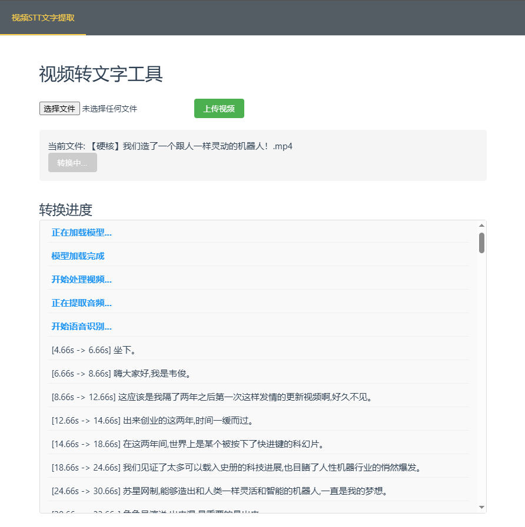

# 视频语音转文字应用

## 项目简介

这是一个基于 Vue3.js 和 Flask 的 Web 应用程序，能够将视频中的语音内容提取并转换为文字。应用使用 Faster Whisper 模型进行高效的语音识别，支持中文语音识别，并实时显示转换进度。

## 主要功能

- 视频文件上传
- 自动提取视频中的音频
- 使用 Faster Whisper 模型进行语音识别
- 实时显示转换进度和结果
- 支持中文语音识别
- 自动清理临时文件


##演示效果



## 技术栈

- **前端**：Vue.js, Vite
- **后端**：Flask, Python
- **语音识别**：Faster Whisper (基于 OpenAI 的 Whisper 模型)
- **视频处理**：FFmpeg

## 安装指南

### 前提条件

- Node.js (v14+)
- Python (v3.10+)
- FFmpeg
- CUDA (用于 GPU 加速，可选)

### 后端安装

1. 克隆仓库：

```bash
git clone https://github.com/ventls/videototext.git
cd videototext
```

2. 创建并激活 Python 虚拟环境：

```bash
python -m venv venv
# Windows
venv\Scripts\activate
# Linux/Mac
source venv/bin/activate
```

3. 安装python后端依赖：

```bash
cd backend
pip install -r requirements.txt
```

4. 安装 FFmpeg (如果尚未安装)：

- **Windows**：从 [FFmpeg 官网](https://ffmpeg.org/download.html) 下载并添加到系统 PATH
- **Ubuntu/Debian**：`sudo apt install ffmpeg`
- **Mac**：`brew install ffmpeg`

5. 安装 CUDA 和 cuDNN (可选，用于 GPU 加速)：

- 从 [NVIDIA 官网](https://developer.nvidia.com/cuda-downloads) 下载并安装 CUDA
- 从 [NVIDIA 开发者网站](https://developer.nvidia.com/cudnn) 下载并安装 cuDNN

### 前端安装


1. 安装前端依赖：

```bash
npm install
```

## 运行应用

### 启动后端服务

1. 确保在项目根目录下：

2. 启动 Flask 服务器：

```bash
python backend/main.py
```

后端服务将在 http://localhost:5000 上运行。

### 启动前端服务

1. 在另一个终端窗口中，进入前端目录：

```bash
cd videototext
```

2. 启动开发服务器：

```bash
npm run dev
```

前端应用将在 http://localhost:5173 (或类似端口) 上运行。

## 使用指南

1. 在浏览器中打开前端应用 URL
2. 点击"上传视频"按钮选择要处理的视频文件
3. 点击"开始转换"按钮开始处理
4. 实时查看处理进度和识别结果
5. 处理完成后，可以查看完整的文字记录
6. 如需重置系统，点击"重置"按钮


## 注意事项

- 视频文件大小和长度可能会影响处理时间
- GPU 加速可以显著提高处理速度
- 应用会自动清理临时文件，无需手动删除
- 语音识别精度取决于音频质量和背景噪音

## 故障排除

- 如果遇到 CUDA 相关错误，可以在 `main.py` 中将 `device="cuda"` 改为 `device="cpu"`
- 确保 FFmpeg 已正确安装并添加到系统 PATH
- 检查网络连接以确保模型可以正常下载